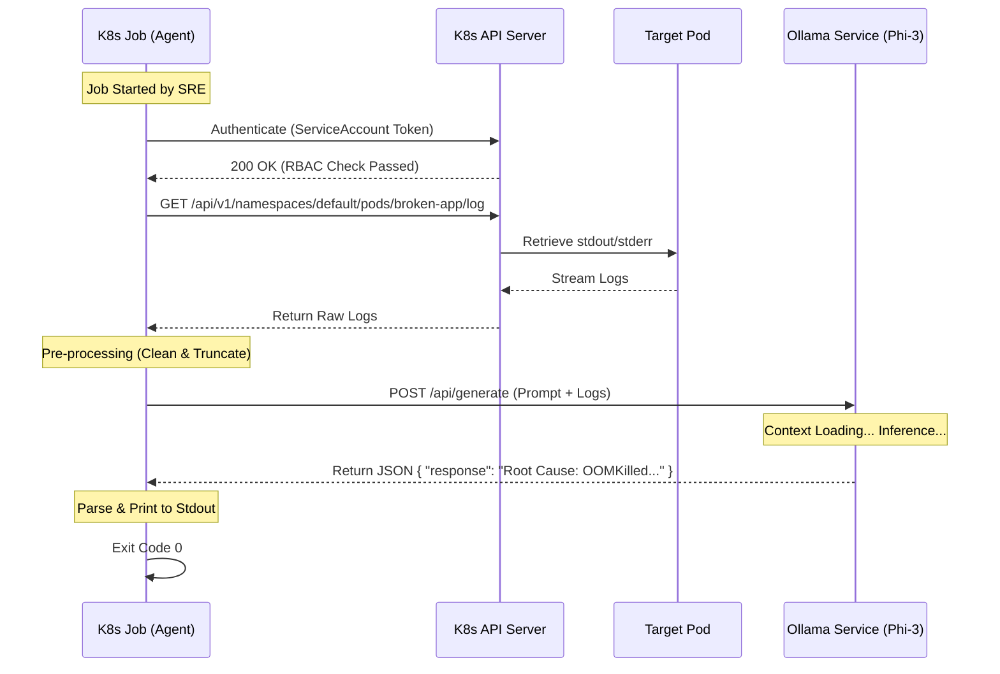

# 🏗️ System Architecture & Design Specification

> **Project:** Local AI-Driven SRE Observability Platform
> **Status:** Production-Ready (Lab Environment)
> **Author:** Baltazar "FB" Scotta
> **Version:** 1.0.0

---

## 📋 Executive Summary
This document outlines the architectural decisions, system components, and data flow of the **AI-Driven SRE Lab**. The platform is designed to emulate a **Self-Healing, Air-Gapped Enterprise Environment** running on local hardware.

The core philosophy is **"GitOps First, AI Augmented."**
1.  **Immutable Infrastructure:** No manual changes are allowed in the cluster.
2.  **Sovereign AI:** All inference happens locally (Edge AI), ensuring no sensitive log data leaves the network boundary.
3.  **Automated Diagnosis:** Operational triage is delegated to an ephemeral internal agent to reduce MTTR (Mean Time to Resolution).

---

## 🔭 High-Level Architecture

The system follows a **Hub-and-Spoke GitOps Pattern**, adapted for local execution. It strictly separates the **Control Plane** (ArgoCD), **Data Plane** (Workloads), and **Intelligence Plane** (AI Agent).

```mermaid
graph TD
    subgraph "Host Layer (Local Machine)"
        User[User / SRE]
        Terraform[Terraform CLI]
        Git[GitHub Repository]
    end

    subgraph "Kubernetes Cluster (Kind)"
        direction TB
        
        subgraph "Control Plane Namespace"
            ArgoCD[⚙️ ArgoCD Controller]
        end

        subgraph "Default Namespace (Workloads)"
            App[📦 Target App (Python/Flask)]
            Ollama[🧠 AI Engine (Phi-3)]
            Agent[🕵️ AI SRE Agent (Job)]
        end

        subgraph "Monitoring Namespace"
            Prom[📊 Prometheus]
            Grafana[📈 Grafana]
        end
    end

    %% Flows
    User -->|Define IaC| Terraform
    Terraform -->|Provision| Kind
    User -->|Push Config| Git
    ArgoCD -->|Sync State (Pull)| Git
    ArgoCD -->|Apply Manifests| App & Ollama & Prom
    Prom -->|Scrape Metrics| App
    Agent -->|Fetch Logs| App
    Agent -->|Request Analysis (HTTP)| Ollama
    Ollama -->|Return Diagnosis| Agent

```

---

## 🕵️ Sequence Design: The AI Agent Workflow

How the "Detective" works internally without external access.



---

## 🧠 Architectural Decision Records (ADR)

*Using the Michael Nygard format (Context, Decision, Consequences).*

### ADR-001: Infrastructure Provisioning Strategy

* **Context:** We need a local Kubernetes environment that closely mimics a cloud-managed service (EKS/GKE) to validate SRE workflows.
* **Decision:** Use **Kind (Kubernetes in Docker)** provisioned via **Terraform**.
* **Discarded Alternatives:**
* *Minikube:* Good for beginners, but runs as a single VM/Container node by default. Harder to simulate node failures or affinity rules.
* *K3s:* Lightweight, but API behavior differs slightly from upstream Kubernetes.


* **Consequences:**
* ✅ Allows multi-node simulation (1 Control, 2 Workers) on a single laptop.
* ✅ Terraform `kubernetes` provider creates a portable skill set applicable to AWS/Azure.
* ⚠️ Higher resource overhead (requires Docker running 3 heavy containers).


### ADR-002: GitOps Delivery Model

* **Context:** We need to deploy applications and configurations without manual `kubectl apply` commands to prevent configuration drift.
* **Decision:** **Pull-Based GitOps** using **ArgoCD**.
* **Discarded Alternatives:**
* *Push-Based (GitHub Actions):* Requires giving GitHub "Admin" credentials to the cluster. Security risk.


* **Consequences:**
* ✅ **Security:** The cluster requires no inbound access from the internet; it reaches *out* to GitHub.
* ✅ **Self-Healing:** If a human manually edits a deployment, ArgoCD detects the drift and reverts it immediately.
* ⚠️ Introduces a "chicken-and-egg" problem: ArgoCD itself must be installed first (bootstrapped manually).


### ADR-003: AI Inference Engine

* **Context:** We need to perform log analysis using an LLM without sending sensitive data to public APIs (OpenAI/Gemini).
* **Decision:** **Ollama** running **Phi-3 Mini (3.8B)** inside the cluster.
* **Discarded Alternatives:**
* *Llama-3 (8B):* Too heavy for a standard laptop (needs >8GB VRAM).
* *DeepSeek Coder:* Excellent for code, but Phi-3 is better optimized for reasoning on small hardware.


* **Consequences:**
* ✅ **Air-Gap:** No data leaves the cluster network.
* ✅ **Zero Cost:** No API tokens or per-token billing.
* ⚠️ **Performance:** Inference is CPU-bound and slow (10-15 tokens/sec) compared to cloud GPUs.


### ADR-004: Agent Implementation Language

* **Context:** We need a script to glue the K8s API and the LLM together.
* **Decision:** **Python** (using `requests` and `kubernetes` client).
* **Discarded Alternatives:**
* *Go (Golang):* Standard for K8s tools, but string manipulation and prompt engineering are more verbose than Python.
* *Bash:* Too fragile for complex JSON parsing and HTTP error handling.


* **Consequences:**
* ✅ Rapid prototyping and rich ecosystem for text processing.
* ⚠️ Larger container image size (Python runtime vs. Go binary).


---

## 🔒 Security Posture & RBAC

*How we secure the "Internal Detective".*

The AI Agent runs as a **Kubernetes Job**. It does not use the default admin credentials. Instead, we adhere to the **Principle of Least Privilege (PoLP)**.

**ServiceAccount Permissions:**
The Agent is bound to a specific `Role` that allows ONLY:

1. **VERB:** `get`, `list`
2. **RESOURCE:** `pods`, `pods/log`
3. **NAMESPACE:** `default`

It **cannot** delete pods, read secrets, or modify deployments. This ensures that even if the Agent is compromised (e.g., prompt injection), the attacker cannot destroy the cluster.

---

## 🚧 Production Gap Analysis

*Comparing this Lab Environment vs. a Real Enterprise Production Setup.*

| Component | 🏠 Lab Implementation | 🏢 Production Standard | ⚠️ Remediation for Prod |
| --- | --- | --- | --- |
| **Storage** | `HostPath` (Local Docker Disk) | `CSI` (EBS / PersistentDisk) | Use cloud storage classes (`gp3`) to ensure data persists across node termination and Availability Zones. |
| **Secrets** | Kubernetes Secrets (YAML) | External Secrets Operator | Integrate with AWS Secrets Manager or HashiCorp Vault. **Never** commit base64 secrets to Git. |
| **Ingress** | `kubectl port-forward` | Ingress Controller + DNS | Deploy Nginx/ALB Ingress Controller with `external-dns` and `cert-manager` for automatic SSL/TLS. |
| **AI Compute** | CPU Inference (Slow) | GPU Node Pool | Use Kubernetes **Taints & Tolerations** to pin AI workloads to GPU-accelerated nodes (e.g., NVIDIA A100/T4). |
| **Scaling** | Manual Replicas | Horizontal Pod Autoscaler | Implement HPA based on Custom Metrics (e.g., Request Rate) using **KEDA**. |
| **Registry** | Sideloaded Images | ECR / GCR / Harbor | Use a private container registry with vulnerability scanning (Trivy/Clair). |

---

## 📈 Future Roadmap

* **Event-Driven Diagnosis:** Replace the manual Job with a **Prometheus AlertManager Webhook**. When an alert fires (e.g., `KubePodCrashLooping`), it automatically triggers the AI Agent to analyze the specific crashing pod.
* **Vector Database Integration:** Implement **RAG (Retrieval-Augmented Generation)**. Feed the cluster's specific "Runbooks" into a vector DB so the AI can reference company-specific documentation during diagnosis.

---

## 📚 Stack & Versions

* **Kubernetes:** v1.27 (Kind)
* **Orchestrator:** Terraform v1.5+
* **GitOps:** ArgoCD v2.10
* **AI Engine:** Ollama (running Phi-3 Mini 4k)
* **Observability:** Kube-Prometheus-Stack (Prometheus v2.45, Grafana v10.0)

```

