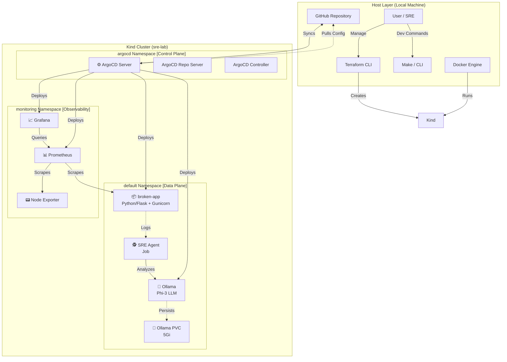
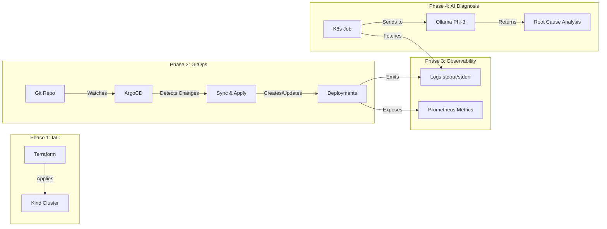
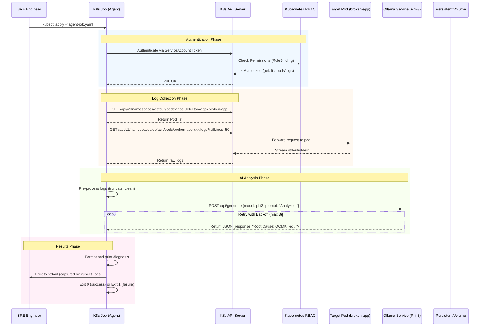
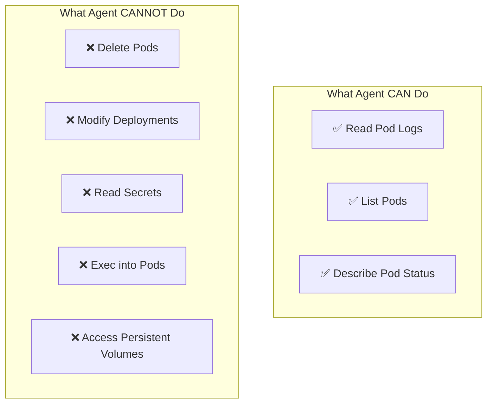
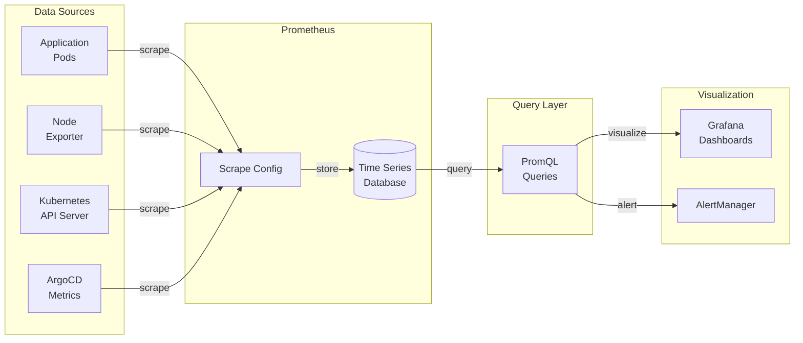
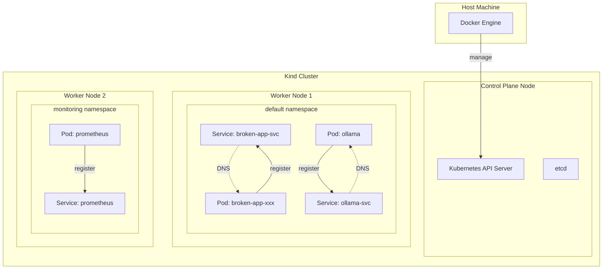

# 🏗️ System Architecture & Design Specification

> **Project:** Local AI-Driven SRE Observability Platform
> **Status:** Production-Ready (Lab Environment)
> **Author:** Baltazar "FB" Scotta
> **Version:** 2.1.0

---

## 📋 Executive Summary

This document outlines the architectural decisions, system components, and data flow of the **AI-Driven SRE Lab**. The platform is designed to emulate a **Self-Healing, Air-Gapped Enterprise Environment** running on local hardware.

The core philosophy is **"GitOps First, AI Augmented."**

1. **Immutable Infrastructure:** No manual changes are allowed in the cluster.
2. **Sovereign AI:** All inference happens locally (Edge AI), ensuring no sensitive log data leaves the network boundary.
3. **Automated Diagnosis:** Operational triage is delegated to an ephemeral internal agent to reduce MTTR (Mean Time to Resolution).
4. **Security by Default:** Containers run as non-root, least-privilege RBAC, pinned dependencies.

---

## 🔭 High-Level Architecture

The system follows a **Hub-and-Spoke GitOps Pattern**, adapted for local execution. It strictly separates the **Control Plane** (ArgoCD), **Data Plane** (Workloads), **Intelligence Plane** (AI Agent), and **Observability Plane** (Monitoring).

### System Diagram


```mermaid
graph TD
    subgraph "Host Layer (Local Machine)"
        User[User / SRE]
        Terraform[Terraform CLI]
        Git[GitHub Repository]
        Make[Make / CLI]
        Docker[Docker Engine]
    end

    subgraph "Kind Cluster (sre-lab)"
        subgraph "argocd Namespace [Control Plane]"
            ArgoCD[⚙️ ArgoCD Server]
            ArgoRepo[ArgoCD Repo Server]
            ArgoCtrl[ArgoCD Controller]
        end

        subgraph "default Namespace [Data Plane]"
            App[📦 broken-app<br/>Python/Flask + Gunicorn]
            Ollama[🧠 Ollama<br/>Phi-3 LLM]
            Agent[🕵️ SRE Agent<br/>Job]
            PVC[💾 Ollama PVC<br/>5Gi]
        end

        subgraph "monitoring Namespace [Observability]"
            Prom[📊 Prometheus]
            Grafana[📈 Grafana]
            NodeExp[📟 Node Exporter]
        end
    end

    %% External Interactions
    Docker -->|Runs| Kind
    User -->|Manage| Terraform
    User -->|Dev Commands| Make
    Git <-.->|Pulls Config| ArgoCD

    %% Internal Flows
    Terraform -->|Creates| Kind
    ArgoCD -->|Syncs| Git
    ArgoCD -->|Deploys| App
    ArgoCD -->|Deploys| Ollama
    ArgoCD -->|Deploys| Prom
    ArgoCD -->|Deploys| Grafana

    App -.->|Logs| Agent
    Agent -->|Analyzes| Ollama
    Ollama -.->|Persists| PVC

    Prom -->|Scrapes| App
    Prom -->|Scrapes| NodeExp
    Grafana -->|Queries| Prom
```

---

## 🔄 Data Flow Architecture

This section explains how data flows through the system, from infrastructure provisioning to AI-driven diagnosis.


```mermaid
flowchart LR
    subgraph "Phase 1: IaC"
        TF[Terraform] -->|Applies| K8s[Kind Cluster]
    end

    subgraph "Phase 2: GitOps"
        Git[Git Repo] -->|Watches| ArgoCD
        ArgoCD -->|Detects Changes| Sync[Sync & Apply]
        Sync -->|Creates/Updates| Deploy[Deployments]
    end

    subgraph "Phase 3: Observability"
        Deploy -->|Emits| Logs[Logs stdout/stderr]
        Deploy -->|Exposes| Metrics[Prometheus Metrics]
    end

    subgraph "Phase 4: AI Diagnosis"
        Job[K8s Job] -->|Fetches| Logs
        Job -->|Sends to| LLM[Ollama Phi-3]
        LLM -->|Returns| Analysis[Root Cause Analysis]
    end
```

---

## 🕵️ Sequence Design: The AI Agent Workflow

How the "Detective" works internally without external access.


```mermaid
sequenceDiagram
    participant SRE as SRE Engineer
    participant Job as K8s Job (Agent)
    participant API as K8s API Server
    participant RBAC as Kubernetes RBAC
    participant Pod as Target Pod (broken-app)
    participant Ollama as Ollama Service (Phi-3)
    participant PVC as Persistent Volume

    SRE->>Job: kubectl apply -f agent-job.yaml

    rect rgb(240, 248, 255)
        Note over Job,RBAC: Authentication Phase
        Job->>API: Authenticate via ServiceAccount Token
        API->>RBAC: Check Permissions (RoleBinding)
        RBAC-->>API: ✓ Authorized (get, list pods/logs)
        API-->>Job: 200 OK
    end

    rect rgb(255, 248, 240)
        Note over Job,API: Log Collection Phase
        Job->>API: GET /api/v1/namespaces/default/pods?labelSelector=app=broken-app
        API-->>Job: Return Pod list
        Job->>API: GET /api/v1/namespaces/default/pods/broken-app-xxx/logs?tailLines=50
        API->>Pod: Forward request to pod
        Pod-->>API: Stream stdout/stderr
        API-->>Job: Return raw logs
    end

    rect rgb(248, 255, 240)
        Note over Job,Ollama: AI Analysis Phase
        Job->>Job: Pre-process logs (truncate, clean)
        Job->>Ollama: POST /api/generate {model: phi3, prompt: "Analyze..."}
        
        loop Retry with Backoff (max 3)
            Ollama-->>Job: Return JSON {response: "Root Cause: OOMKilled..."}
        end
    end

    rect rgb(255, 240, 248)
        Note over Job,SRE: Results Phase
        Job->>Job: Format and print diagnosis
        Job->>SRE: Print to stdout (captured by kubectl logs)
        Job->>Job: Exit 0 (success) or Exit 1 (failure)
    end
```

---

## 🧠 Architectural Decision Records (ADR)

*Using the Michael Nygard format (Context, Decision, Consequences).*

### ADR-001: Infrastructure Provisioning Strategy

* **Context:** We need a local Kubernetes environment that closely mimics a cloud-managed service (EKS/GKE) to validate SRE workflows.
* **Decision:** Use **Kind (Kubernetes in Docker)** provisioned via **Terraform**.

* **Why not other options?**

| Alternative | Why We Didn't Choose It |
|-------------|------------------------|
| **Minikube** | Runs as a single VM/container by default. Harder to simulate node failures, affinity rules, or multi-availability-zone scenarios. Less similar to production EKS/GKE. |
| **K3s** | Lightweight, but the API behavior differs slightly from upstream Kubernetes. Some kubectl commands behave differently, which reduces its value as a learning tool. |
| **Docker Desktop + Ingress** | Requires paid Docker Desktop license on newer versions. Less portable across operating systems. No native multi-node support. |
| **Cloud-based EKS/AKS/GKE** | **Counter to project goal.** We need air-gapped, local-only operation. Cloud would defeat the purpose of the lab. |

* **Consequences:**
  * ✅ Allows multi-node simulation (1 Control, 2 Workers) on a single laptop.
  * ✅ Terraform `kubernetes` provider creates a portable skill set applicable to AWS/Azure.
  * ✅ Kind clusters are fast to create/destroy - great for iterative learning.
  * ⚠️ Higher resource overhead (requires Docker running 3 heavy containers).
  * ⚠️ Some features (like LoadBalancer services) require workarounds.

---

### ADR-002: GitOps Delivery Model

* **Context:** We need to deploy applications and configurations without manual `kubectl apply` commands to prevent configuration drift.
* **Decision:** **Pull-Based GitOps** using **ArgoCD**.

* **Why not other options?**

| Alternative | Why We Didn't Choose It |
|-------------|------------------------|
| **Push-Based (GitHub Actions)** | Requires giving GitHub "Admin" credentials to the cluster. Security risk - if GitHub is compromised, cluster is compromised. Also requires the cluster to have inbound internet access. |
| **Jenkins X** | Overwhelming for a simple lab. Steep learning curve. More suited for enterprise multi-team environments. |
| **Flux v1** | Older version. Flux v2 (now Flux) is better but ArgoCD has a more intuitive UI for beginners. |
| **Manual kubectl apply** | **Counter to GitOps philosophy.** No audit trail, no drift detection, no rollback capability. Teaches bad habits. |
| **Helmfile + Kustomize** | Good tools, but they handle templating - not full GitOps. Need ArgoCD on top for the pull-based reconciliation. |

* **Consequences:**
  * ✅ **Security:** The cluster requires no inbound access from the internet; it reaches *out* to GitHub.
  * ✅ **Self-Healing:** If a human manually edits a deployment, ArgoCD detects the drift and reverts it immediately.
  * ✅ **Visual Feedback:** ArgoCD UI makes it easy to see what's deployed and sync status.
  * ⚠️ Introduces a "chicken-and-egg" problem: ArgoCD itself must be installed first (bootstrapped manually).
  * ⚠️ Requires the cluster to have network access to GitHub (or a local git server).

---

### ADR-003: AI Inference Engine

* **Context:** We need to perform log analysis using an LLM without sending sensitive data to public APIs (OpenAI/Gemini).
* **Decision:** **Ollama** running **Phi-3 Mini (3.8B)** inside the cluster.

* **Why not other options?**

| Alternative | Why We Didn't Choose It |
|-------------|------------------------|
| **OpenAI API (GPT-4)** | **Counter to air-gap goal.** Sends potentially sensitive logs to external API. Costs money per token. Requires internet access. |
| **Google Gemini API** | Same issues as OpenAI. Data leaves the cluster. |
| **Llama-3 (8B or 70B)** | 8B model needs >8GB VRAM, 70B needs massive GPU. Too heavy for typical laptop CPU inference. |
| **DeepSeek Coder** | Excellent for code understanding, but Phi-3 is better optimized for general reasoning on small hardware. Also heavier than Phi-3. |
| **Mistral 7B** | Good option, but Phi-3 was specifically optimized for CPU/edge inference. |
| **Self-hosted OpenWebUI** | UI wrapper around Ollama. Adds complexity without adding value for this lab. |
| **LocalAI** | Similar to Ollama but less polished. Ollama has better model management and simpler API. |

* **Consequences:**
  * ✅ **Air-Gap:** No data leaves the cluster network.
  * ✅ **Zero Cost:** No API tokens or per-token billing.
  * ✅ **Educational:** Shows how to run AI workloads in K8s.
  * ⚠️ **Performance:** Inference is CPU-bound and slow (10-15 tokens/sec) compared to cloud GPUs.
  * ⚠️ **Model Management:** Requires manual `ollama pull` to download models.

---

### ADR-004: Agent Implementation Language

* **Context:** We need a script to glue the K8s API and the LLM together.
* **Decision:** **Python** (using `requests` with retry logic via `urllib3`).

* **Why not other options?**

| Alternative | Why We Didn't Choose It |
|-------------|------------------------|
| **Go (Golang)** | Standard for K8s tools (kubectl, helm), but string manipulation and prompt engineering are more verbose than Python. Longer compile times. Larger binary if compiled. |
| **Bash** | Too fragile for complex JSON parsing. HTTP error handling is painful. No built-in retry logic. Hard to debug. |
| **JavaScript/Node.js** | Good option, but less familiar for SRE/DevOps engineers who typically know Python better. |
| **Ruby** | Smaller ecosystem. Fewer HTTP client options. |
| **Rust** | Overkill for a simple script. Longer compile times. Harder to read for beginners. |

* **Consequences:**
  * ✅ Rapid prototyping and rich ecosystem for text processing.
  * ✅ Built-in retry logic via `urllib3`.
  * ✅ Most SREs/DevOps engineers know Python.
  * ⚠️ Larger container image size (Python runtime vs. Go binary ~10MB vs ~50MB).
  * ⚠️ Slower cold start time compared to compiled languages.

---

### ADR-005: Container Security Posture

* **Context:** We need to run containers securely without root privileges.
* **Decision:** Use non-root user (`appuser`, UID 1000) in Docker images.

* **Why not other options?**

| Alternative | Why We Didn't Choose It |
|-------------|------------------------|
| **Running as root (UID 0)** | **Security risk.** Containers with root can modify host filesystem if container escapes. Violates principle of least privilege. |
| **Random UID (Dynamic)** | Harder to debug file permissions. Doesn't work well with volume mounts. |
| **Kubernetes Pod Security Policy** | Deprecated in K8s 1.21+, replaced by Pod Security Admission. More complex to set up. |

* **Consequences:**
  * ✅ **Security:** Containers cannot modify host system files.
  * ✅ **Compliance:** Aligns with CIS Docker Benchmark.
  * ✅ **Defense in Depth:** Even if container is compromised, attacker has limited permissions.
  * ⚠️ Some applications may require file permission adjustments (e.g., writing to `/tmp`).
  * ⚠️ Need to ensure volume mounts are owned by UID 1000.

---

### ADR-006: Application Server

* **Context:** We need a production-ready HTTP server for the Flask application.
* **Decision:** Use **Gunicorn** with 4 workers.

* **Why not other options?**

| Alternative | Why We Didn't Choose It |
|-------------|------------------------|
| **Flask Development Server** | **Security risk.** Flask's built-in server is for development only. Not designed for production - doesn't handle concurrent requests well. |
| **Waitress** | Pure Python like Gunicorn, but less battle-tested. Fewer configuration options. |
| **uWSGI** | Powerful but complex configuration. Overkill for simple Flask app. |
| **Gunicorn + Nginx** | Nginx would be better for production, but adds complexity. For a lab environment, Gunicorn alone is sufficient. |
| **ASGI (Uvicorn/FastAPI)** | Good choice, but our app is Flask (WSGI). Would require rewriting. |

* **Consequences:**
  * ✅ Handles concurrent requests efficiently (4 workers = 4 processes).
  * ✅ Proper timeout handling.
  * ✅ Graceful shutdown support.
  * ⚠️ Need to configure worker count based on CPU cores.

---

### ADR-007: Monitoring Stack

* **Context:** We need to collect and visualize metrics from the cluster.
* **Decision:** Use **Prometheus + Grafana + Node Exporter**.

* **Why not other options?**

| Alternative | Why We Didn't Choose It |
|-------------|------------------------|
| **Datadog** | SaaS - requires internet. Costs money. **Counter to air-gap goal.** |
| **New Relic** | Same issues as Datadog. |
| **VictoriaMetrics** | Good alternative to Prometheus, but less ecosystem integration. |
| **Thanos** | Adds horizontal scaling to Prometheus, overkill for lab. |
| **ELK/EFK Stack** | Better for log aggregation. Heavier. Not designed for time-series metrics. |
| **InfluxDB + Grafana** | InfluxDB is a database, not a scraper. Need a separate scraper (like Telegraf). |

* **Consequences:**
  * ✅ Industry standard for Kubernetes monitoring.
  * ✅ Huge ecosystem of exporters.
  * ✅ Grafana has excellent dashboards.
  * ⚠️ Prometheus storage is local-only (no built-in persistence).
  * ⚠️ Requires tuning for large clusters (not an issue for this lab).

---

## 🔒 Security Posture & RBAC

*How we secure the "Internal Detective".*

The AI Agent runs as a **Kubernetes Job**. It does not use the default admin credentials. Instead, we adhere to the **Principle of Least Privilege (PoLP)**.

### ServiceAccount Permissions

The Agent is bound to a specific `Role` that allows ONLY:

1. **VERB:** `get`, `list`
2. **RESOURCE:** `pods`, `pods/log`
3. **NAMESPACE:** `default`

It **cannot** delete pods, read secrets, or modify deployments. This ensures that even if the Agent is compromised (e.g., prompt injection), the attacker cannot destroy the cluster.

### Why This Security Model?


```mermaid
graph TD
    subgraph "What Agent CAN Do"
        CanRead[✅ Read Pod Logs]
        CanList[✅ List Pods]
        CanDescribe[✅ Describe Pod Status]
    end

    subgraph "What Agent CANNOT Do"
        CantDelete[❌ Delete Pods]
        CantWrite[❌ Modify Deployments]
        CantSecrets[❌ Read Secrets]
        CantExec[❌ Exec into Pods]
        CantPV[❌ Access Persistent Volumes]
    end
```

### Container Security

- **Non-root user:** All containers run as `appuser` (UID 1000)
- **Read-only root filesystem:** Recommended for production
- **Pinned dependencies:** All Python packages version-pinned in Dockerfile
- **No secrets in code:** All credentials via environment variables
- **Image scanning:** In production, use Trivy/Clair to scan for vulnerabilities

---

## 📊 Observability Architecture

The monitoring stack follows the **Prometheus Pull Model**:


```mermaid
graph LR
    subgraph "Data Sources"
        App[Application<br/>Pods]
        Node[Node<br/>Exporter]
        K8sAPI[Kubernetes<br/>API Server]
        Argo[ArgoCD<br/>Metrics]
    end
    
    subgraph "Prometheus"
        Scrape[Scrape Config]
        TSDB[(Time Series<br/>Database)]
    end
    
    subgraph "Query Layer"
        Query[PromQL<br/>Queries]
    end
    
    subgraph "Visualization"
        Graf[Grafana<br/>Dashboards]
        Alert[AlertManager]
    end
    
    App -->|scrape| Scrape
    Node -->|scrape| Scrape
    K8sAPI -->|scrape| Scrape
    Argo -->|scrape| Scrape
    
    Scrape -->|store| TSDB
    TSDB -->|query| Query
    Query -->|visualize| Graf
    Query -->|alert| Alert
```

### Metrics Collection Details

| Target | Endpoint | Scrape Interval | Metrics |
|--------|----------|----------------|---------|
| broken-app | `prometheus.io/scrape` annotation | 15s | Custom app metrics |
| Node Exporter | `/metrics` | 15s | CPU, Memory, Disk, Network |
| Kubernetes API | `/apis/*` | 30s | Pod/Node/Service status |
| Prometheus | `/metrics` | 60s | Internal metrics |

### Prometheus Configuration

The Prometheus config uses **Kubernetes Service Discovery** to automatically find targets:

```yaml
scrape_configs:
  - job_name: 'kubernetes-pods'
    kubernetes_sd_configs:
      - role: pod
    relabel_configs:
      - source_labels: [__meta_kubernetes_pod_annotation_prometheus_io_scrape]
        action: keep
        regex: true
```

---

## 🏗️ Network Architecture

How networking works in the cluster:


```mermaid
graph TB
    subgraph "Host Machine"
        Docker[Docker Engine]
    end

    subgraph "Kind Cluster"
        subgraph "Control Plane Node"
            API[Kubernetes API Server]
            etcd[etcd]
        end

        subgraph "Worker Node 1"
            subgraph "default namespace"
                Svc1[Service: broken-app-svc]
                Pod1[Pod: broken-app-xxx]
                Svc2[Service: ollama-svc]
                Pod2[Pod: ollama]
            end
        end

        subgraph "Worker Node 2"
            subgraph "monitoring namespace"
                Svc3[Service: prometheus]
                Pod3[Pod: prometheus]
            end
        end
    end

    Docker -->|manage| API
    Pod1 -->|register| Svc1
    Pod2 -->|register| Svc2
    Pod3 -->|register| Svc3
    Svc1 -.->|DNS| Pod1
    Svc2 -.->|DNS| Pod2
```

### Service Discovery

- **Cluster DNS:** Kubernetes provides DNS for services (`<service>.<namespace>.svc.cluster.local`)
- **DNS Resolution:** `ollama-svc.default.svc.cluster.local` resolves to the Ollama pod IP
- **Why not LoadBalancer?** Kind doesn't support LoadBalancer type services natively

---

## 🚧 Production Gap Analysis

*Comparing this Lab Environment vs. a Real Enterprise Production Setup.*

| Component | 🏠 Lab Implementation | 🏢 Production Standard | ⚠️ Remediation for Prod |
|-----------|----------------------|------------------------|-------------------------|
| **Storage** | `HostPath` (Local Docker Disk) | `CSI` (EBS / PersistentDisk) | Use cloud storage classes (`gp3`) to ensure data persists across node termination and Availability Zones. |
| **Secrets** | Kubernetes Secrets (YAML) | External Secrets Operator | Integrate with AWS Secrets Manager or HashiCorp Vault. **Never** commit base64 secrets to Git. |
| **Ingress** | `kubectl port-forward` | Ingress Controller + DNS | Deploy Nginx/ALB Ingress Controller with `external-dns` and `cert-manager` for automatic SSL/TLS. |
| **AI Compute** | CPU Inference (Slow) | GPU Node Pool | Use Kubernetes **Taints & Tolerations** to pin AI workloads to GPU-accelerated nodes (e.g., NVIDIA A100/T4). |
| **Scaling** | Manual Replicas | Horizontal Pod Autoscaler | Implement HPA based on Custom Metrics (e.g., Request Rate) using **KEDA**. |
| **Registry** | Sideloaded Images | ECR / GCR / Harbor | Use a private container registry with vulnerability scanning (Trivy/Clair). |
| **Container Security** | Non-root user | Pod Security Standards | Enable **Pod Security Admission** (PSA) with `restricted` policy. |
| **Network Policy** | None | Network Policies | Implement Calico or Cilium NetworkPolicies to restrict pod-to-pod communication. |
| **Backup** | None | Etcd Backup | Implement automated etcd snapshots and disaster recovery procedures. |

---

## 📈 Future Roadmap

- **Event-Driven Diagnosis:** Replace the manual Job with a **Prometheus AlertManager Webhook**. When an alert fires (e.g., `KubePodCrashLooping`), it automatically triggers the AI Agent to analyze the specific crashing pod.
- **Vector Database Integration:** Implement **RAG (Retrieval-Augmented Generation)**. Feed the cluster's specific "Runbooks" into a vector DB so the AI can reference company-specific documentation during diagnosis.
- **Multi-Cluster Support:** Extend to federate multiple Kind clusters for distributed training.
- **Metrics-Based Diagnosis:** Expand agent to analyze Prometheus metrics, not just logs.
- **Incident Response Automation:** Integrate with PagerDuty or OpsGenie for automatic incident creation.

---

## 📚 Stack & Versions

| Component | Version | Why This Version |
|-----------|---------|------------------|
| Kubernetes | v1.27 (Kind) | Stable, widely used, good ecosystem support |
| Python | 3.12-slim | Latest stable, smallest image size |
| Flask | 3.0.0 | Latest stable release |
| Gunicorn | 21.2.0 | Compatible with Flask 3 |
| Terraform | 1.5+ | Required for kind provider |
| ArgoCD | v2.10.0 | Stable, widely used |
| Ollama | latest | Rolling updates for best model support |
| Phi-3 | mini 4k | Optimized for CPU inference |
| Prometheus | v2.45.0 | Stable, good TSDB performance |
| Grafana | v10.0.0 | Newer UI, better performance |
| Node Exporter | v1.6.1 | Standard node metrics |

---

## 🛠 Development Commands

```bash
# Validate environment
make check

# Lint everything
make lint

# Deploy monitoring
kubectl apply -f k8s/manifests/monitoring/

# Run agent manually
kubectl apply -f k8s/agent-job.yaml
kubectl logs -l job-name=sre-agent-job -f
```
