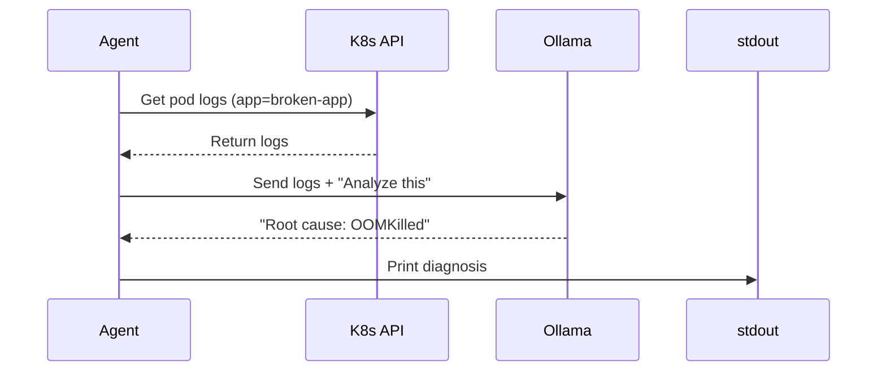

# 🤖 Local AI-Driven SRE Observability Platform

A production-grade, air-gapped Kubernetes platform running entirely on local hardware.

## 📋 Table of Contents

- [Project Overview](#project-overview)
- [Why This Project?](#why-this-project)
- [Prerequisites](#prerequisites)
- [Quick Start](#quick-start)
- [Understanding Each Phase](#understanding-each-phase)
  - [Phase 1: Infrastructure Provisioning](#phase-1-infrastructure-provisioning-terraform)
  - [Phase 2: GitOps Bootstrapping](#phase-2-gitops-bootstrapping-argocd)
  - [Phase 3: The Air-Gap Simulation](#phase-3-the-air-gap-simulation-image-injection)
  - [Phase 4: AI Engine Initialization](#phase-4-ai-engine-initialization)
  - [Phase 5: Critical System Tuning](#phase-5-critical-system-tuning)
  - [Phase 6: Running the AI SRE Agent](#phase-6-running-the-ai-sre-agent)
- [Monitoring Stack](#monitoring-stack)
- [Chaos Engineering Experiments](#chaos-engineering-experiments)
- [Accessing Dashboards](#accessing-dashboards)
- [Development Tools](#development-tools)
- [Troubleshooting](#troubleshooting)
- [Cleanup](#cleanup)
- [Additional Resources](#additional-resources)

---

## 📖 Project Overview

This repository demonstrates a Self-Healing, AI-Integrated Observability Stack. It was engineered to solve a critical challenge: **Automating Root Cause Analysis (RCA) in high-security, air-gapped environments.**

Unlike standard "Hello World" tutorials, this lab simulates real-world constraints:

- **No Public Cloud:** Runs on Kind (Kubernetes in Docker).
- **No External APIs:** Uses a local LLM (Phi-3 via Ollama) for inference.
- **Strict GitOps:** All infrastructure changes are managed by ArgoCD, enforcing state consistency.
- **Kernel-Level Tuning:** Requires modification of host OS sysctl parameters to support high-concurrency monitoring workloads.
- **Secure by Default:** Runs containers as non-root, uses least-privilege RBAC.

For a deep dive into the design decisions, see [ARCHITECTURE.md](ARCHITECTURE.md).

---

## 🤔 Why This Project?

### The Problem

In enterprise environments, especially those dealing with sensitive data (healthcare, finance, government), **air-gapped networks** are common. These networks:

1. **Cannot access the internet** - No API calls to OpenAI, AWS, GCP
2. **Cannot send data out** - Security policies block outbound traffic
3. **Must be self-contained** - All tooling must work offline

Traditional SRE tooling assumes internet access. When something breaks in an air-gapped environment, engineers are left without their favorite AI assistants.

### The Solution

This project demonstrates that you can run **AI-powered observability** without external APIs:

1. **Self-Contained AI:** Run Ollama with Phi-3 directly in the cluster
2. **GitOps:** Use ArgoCD for declarative infrastructure
3. **Observability:** Collect metrics with Prometheus, visualize with Grafana
4. **Automated Diagnosis:** The SRE Agent fetches logs and queries the local LLM

### What You'll Learn

By completing this lab, you'll understand:

- How to set up a multi-node Kubernetes cluster with Kind
- The GitOps philosophy and how ArgoCD works
- How to run AI models locally (Ollama)
- Security best practices (non-root containers, RBAC)
- Monitoring fundamentals (Prometheus + Grafana)
- How to build an AI-powered incident response tool

---

## 🛠 Prerequisites

This lab is resource-intensive. Ensure your machine meets the requirements.

### Hardware Requirements

| Resource | Minimum | Recommended | Why |
|----------|---------|-------------|-----|
| RAM | 16GB | 32GB | Docker + 3 K8s nodes + Prometheus + Ollama |
| CPU | 4 Cores | 8 Cores | Ollama inference is CPU-bound |
| Disk | 20GB | 50GB | Docker images + model weights (~3GB) |

**Note:** The AI Model + Prometheus stack consumes ~6GB-8GB of RAM alone.

### Software Requirements

| Tool | Minimum Version | Check Command | Purpose |
|------|-----------------|---------------|---------|
| Docker | 24.0+ | `docker version` | Runs Kind nodes as containers |
| Terraform | 1.5+ | `terraform -version` | Infrastructure as Code |
| Kubectl | 1.27+ | `kubectl version --client` | K8s CLI |
| Kind | 0.20+ | `kind version` | K8s in Docker |
| Git | 2.30+ | `git --version` | Version control |

### Optional Development Tools

| Tool | Purpose | Install |
|------|---------|---------|
| `make` | Run development tasks | `brew install make` (macOS) or `apt install make` (Linux) |
| `hadolint` | Lint Dockerfiles | `brew install hadolint` |
| `kubeconform` | Validate K8s manifests | `go install github.com/yannh/kubeconform@latest` |
| `pylint` | Lint Python code | `pip install pylint` |

---

## 📁 Project Structure

```
ai-sre-agent/
├── src/                        # Source code
│   ├── app.py                 # Flask application (demo app)
│   ├── agent.py               # AI SRE Agent (log analysis)
│   ├── Dockerfile            # Container image definition
│   └── .dockerignore         # Docker ignore file
├── k8s/                       # Kubernetes manifests
│   ├── bootstrap.yaml        # ArgoCD bootstrap + App of Apps
│   ├── agent-job.yaml        # SRE Agent Job + RBAC
│   ├── kind-config.yaml      # Kind cluster configuration
│   └── manifests/            # Application manifests
│       ├── broken-app.yaml   # Demo application deployment
│       ├── deployment.yaml   # Service definition
│       ├── ollama.yaml       # Ollama AI engine
│       └── monitoring/       # Observability stack
│           ├── prometheus.yaml
│           ├── grafana.yaml
│           └── node-exporter.yaml
├── terraform/                 # Infrastructure as Code
│   ├── main.tf              # Kind cluster + ArgoCD
│   ├── versions.tf           # Provider versions
│   └── .gitignore
├── scripts/                   # Utility scripts
│   └── check-env.sh          # Environment validation
├── Makefile                   # Development commands
├── README.md                  # Main documentation
├── ARCHITECTURE.md           # System design
├── CONTRIBUTING.md           # Contribution guidelines
└── .env.example              # Environment variables template
```

---

## 🚀 Quick Start

```bash
# 1. Validate environment
make check

# 2. Provision infrastructure
cd terraform && terraform init && terraform apply --auto-approve

# 3. Bootstrap ArgoCD
kubectl apply -f k8s/bootstrap.yaml

# 4. Build and load Docker images
docker build -t broken-app:v2 src/
kind load docker-image broken-app:v2 --name sre-lab
kind load docker-image ollama/ollama:latest --name sre-lab

# 5. Pull AI model
kubectl exec -it deployment/ollama -- ollama pull phi3

# 6. Run the SRE Agent
kubectl apply -f k8s/agent-job.yaml
kubectl logs -l job-name=sre-agent-job -f
```

---

## 📚 Understanding Each Phase

### Phase 1: Infrastructure Provisioning (Terraform)

**What happens:**
Terraform creates a 3-node Kubernetes cluster using Kind:

- 1 Control Plane node (manages the cluster)
- 2 Worker nodes (run your workloads)

**Why Terraform?**

> "Why not just run `kind create cluster`?"

Great question! Using Terraform here serves a purpose:

1. **Declarative:** The infrastructure is defined in code, not manual commands
2. **Reproducible:** Same cluster every time
3. **Transferable:** The same Terraform code works with real cloud K8s
4. **Learning:** If you can do Terraform + Kind, you can do Terraform + EKS/GKE

**Commands:**
```bash
cd terraform
terraform init
terraform apply --auto-approve
```

**Verification:**
```bash
kubectl get nodes
# Expected: sre-lab-control-plane, sre-lab-worker, sre-lab-worker2
```

---

### Phase 2: GitOps Bootstrapping (ArgoCD)

**What happens:**
We install ArgoCD, which will automatically sync our K8s manifests from Git.

**Why GitOps?**

> "Why not just `kubectl apply`?"

Traditional Kubernetes management:
```
Developer → kubectl apply → Cluster (manual, error-prone)
```

GitOps:
```
Developer → Git Push → ArgoCD detects → Cluster (automatic, auditable)
```

Benefits:
- **Drift detection:** If someone manually changes something, ArgoCD reverts it
- **Audit trail:** Every change is in Git
- **Self-healing:** Cluster always matches Git state
- **No access to cluster needed:** ArgoCD pulls from Git (security!)

**Commands:**
```bash
kubectl apply -f k8s/bootstrap.yaml
```

**Verification:**
```bash
kubectl get pods -n argocd -w
# Wait for all pods to be Running
```

**⚠️ Important:** Before ArgoCD can sync, update the repository URL in `k8s/bootstrap.yaml` if you're using a fork:
```yaml
data:
  repo.url: https://github.com/YOUR-FORK/ai-sre-agent
```

---

### Phase 3: The Air-Gap Simulation (Image Injection)

**What happens:**
Because Kind runs inside Docker containers, it can't see your host's Docker images. We must "side-load" them.

**Why Kind doesn't see host images?**

```
┌─────────────────────────────────────┐
│         Your Laptop                 │
│  ┌─────────────────────────────┐   │
│  │     Docker Engine           │   │
│  │  - broken-app:v2            │   │
│  │  - ollama/ollama:latest     │   │
│  └─────────────────────────────┘   │
└─────────────────────────────────────┘
              │ (isolated)
              ▼
┌─────────────────────────────────────┐
│       Kind Cluster                  │
│  ┌─────────────────────────────┐    │
│  │   Control Plane Container   │    │
│  │   Worker Container 1        │    │
│  │   Worker Container 2        │    │
│  └─────────────────────────────┘    │
│     Can't see host Docker!          │
└─────────────────────────────────────┘
```

**Solution:** Use `kind load docker-image` to inject images into the cluster nodes.

**Commands:**
```bash
# Build the app
docker build -t broken-app:v2 src/

# Inject into Kind
kind load docker-image broken-app:v2 --name sre-lab
kind load docker-image ollama/ollama:latest --name sre-lab
```

---

### Phase 4: AI Engine Initialization

**What happens:**
Ollama is running, but has no models. We download Phi-3 (~2.4GB).

**Why Phi-3?**

| Model | Size | RAM Needed | CPU Performance | Good For |
|-------|------|------------|-----------------|----------|
| Phi-3 Mini | 3.8B | ~4GB | Good | Reasoning, log analysis |
| Llama-3 8B | 8B | ~8GB | Slow | Complex tasks |
| Mistral 7B | 7B | ~7GB | Slow | General |

Phi-3 is optimized for **CPU inference**, making it perfect for a laptop-based lab.

**Commands:**
```bash
kubectl rollout status deployment/ollama
kubectl exec -it deployment/ollama -- ollama pull phi3
```

**Note:** This may take several minutes depending on your internet speed.

---

### Phase 5: Critical System Tuning

**⚠️ DO NOT SKIP THIS STEP.**

**What happens:**
We increase Linux kernel limits for file watchers.

**Why is this needed?**

```
Prometheus: "I need to watch all these files!"
Linux: "Sorry, too many files! Error: too many open files"
Prometheus: *CrashLoopBackOff*
```

Running Prometheus, Grafana, ArgoCD, and Ollama simultaneously opens thousands of file handles. The default Linux limit (8,192) is too low.

**Commands:**
```bash
# Temporary (resets on reboot)
sudo sysctl fs.inotify.max_user_watches=524288
sudo sysctl fs.inotify.max_user_instances=512

# Permanent (adds to /etc/sysctl.conf)
echo "fs.inotify.max_user_watches=524288" | sudo tee -a /etc/sysctl.conf
echo "fs.inotify.max_user_instances=512" | sudo tee -a /etc/sysctl.conf
```

---

### Phase 6: Running the AI SRE Agent

**What happens:**
The SRE Agent is a Kubernetes Job that:

1. **Fetches logs** from the broken-app using kubectl
2. **Sends to Ollama** for AI-powered analysis
3. **Prints diagnosis** to stdout

**How it works:**



**Why run as a Job?**

- **Ephemeral:** Runs once, doesn't consume resources when idle
- **Self-cleaning:** TTL (time-to-live) automatically deletes it
- **Secure:** Can use limited ServiceAccount

**Commands:**
```bash
# Upload agent script as ConfigMap
kubectl create configmap agent-code --from-file=src/agent.py --dry-run=client -o yaml | kubectl apply -f -

# Run the job
kubectl delete job sre-agent-job 2>/dev/null || true
kubectl apply -f k8s/agent-job.yaml

# Watch results
kubectl logs -l job-name=sre-agent-job -f
```

### Agent Environment Variables

| Variable | Default | Description |
|----------|---------|-------------|
| `LLM_PROVIDER` | `ollama` | Provider: `ollama` or `google` |
| `OLLAMA_HOST` | `ollama-svc` | Ollama service name |
| `OLLAMA_NAMESPACE` | `default` | Ollama namespace |
| `OLLAMA_MODEL` | `phi3` | Model to use |
| `OLLAMA_TIMEOUT` | `60` | Request timeout (seconds) |
| `OLLAMA_MAX_RETRIES` | `3` | Number of retries |
| `POD_NAME` | `broken-app` | Target pod label |

---

## 📊 Monitoring Stack

The platform includes a complete observability stack:

### Components

| Component | Purpose | Port | Why This Component |
|-----------|---------|------|-------------------|
| **Prometheus** | Metrics collection | 9090 | Industry standard for K8s monitoring |
| **Grafana** | Dashboards & visualization | 3000 | Best-in-class visualization |
| **Node Exporter** | Node-level metrics | 9100 | Exports system-level metrics |

### How Metrics Flow

```
App (metrics) ──▶ Prometheus (scrape) ──▶ TSDB (storage)
                                                    │
Node Exporter (metrics) ───────────────────────────┤
                                                    ▼
                                           Grafana (visualize)
```

### Deploy Monitoring

```bash
kubectl apply -f k8s/manifests/monitoring/
```

### Prometheus Targets

The monitoring stack automatically scrapes:

- Kubernetes API servers (cluster health)
- Kubernetes nodes (CPU, memory, disk)
- Pods with `prometheus.io/scrape=true` annotation
- Node Exporter (system metrics)

---

## 🧪 Chaos Engineering Experiments

Let's break things on purpose to prove the AI works!

### Scenario A: The "Junior Dev" Mistake

**What's wrong:** Using Flask dev server in production

**Steps:**
1. Modify `src/Dockerfile`:
   ```dockerfile
   CMD ["python", "app.py"]
   ```

2. Rebuild and reload:
   ```bash
   docker build -t broken-app:v2 src/
   kind load docker-image broken-app:v2 --name sre-lab
   kubectl rollout restart deployment broken-app
   ```

3. Run the Agent (see Phase 6)

**Expected AI Response:**
> "The logs show 'WARNING: Do not use the development server in a production environment.' This indicates the Flask development server is being used instead of Gunicorn. Fix: Use Gunicorn with multiple workers."

---

### Scenario B: The Memory Leak (OOM Kill)

**What's wrong:** Too little memory allocated

**Steps:**
1. Modify `k8s/manifests/broken-app.yaml`:
   ```yaml
   resources:
     limits:
       memory: "10Mi"  # Way too low!
   ```

2. Apply:
   ```bash
   kubectl apply -f k8s/manifests/broken-app.yaml
   ```

3. Run the Agent

**Expected AI Response:**
> "The pod was terminated with exit code 137 (SIGKILL), indicating an OOM (Out of Memory) kill. The memory limit of 10Mi is insufficient. Fix: Increase memory limit to at least 256Mi."

---

## 📊 Accessing Dashboards

Since this is a local cluster, we use port-forward to access UIs.

### ArgoCD UI

```bash
kubectl port-forward svc/argocd-server -n argocd 8080:443
```

- **URL:** https://localhost:8080 (Accept SSL warning)
- **Username:** admin
- **Password:** 
  ```bash
  kubectl -n argocd get secret argocd-initial-admin-secret -o jsonpath="{.data.password}" | base64 -d
  ```

### Grafana

```bash
kubectl port-forward svc/prometheus-grafana -n monitoring 3000:80
```

- **URL:** http://localhost:3000
- **Username:** admin
- **Password:** prom-operator

### Prometheus

```bash
kubectl port-forward svc/prometheus -n monitoring 9090:9090
```

- **URL:** http://localhost:9090

---

## 🛠 Development Tools

### Available Make Commands

```bash
make help              # Show available targets
make check             # Run environment check
make lint              # Run all linters
make lint-docker       # Lint Dockerfiles
make lint-k8s          # Validate K8s manifests
make lint-python       # Lint Python code
make validate          # Validate YAML syntax
make test              # Run tests
make clean             # Clean up generated files
make install-deps      # Install development dependencies
make deploy            # Deploy all K8s resources
make deploy-monitoring # Deploy monitoring stack
make destroy           # Destroy Terraform resources
```

---

## 🆘 Troubleshooting

### 1. "failed to create fsnotify watcher: too many open files"

**Cause:** You skipped Phase 5.

**Fix:**
```bash
sudo sysctl fs.inotify.max_user_watches=524288
sudo sysctl fs.inotify.max_user_instances=512
```

---

### 2. Ollama Connection Error: Read timed out

**Cause:** Your CPU is overloaded.

**Fix:** Scale down monitoring:
```bash
kubectl scale deployment -n monitoring --replicas=0 --all
kubectl scale statefulset -n monitoring --replicas=0 --all
```

---

### 3. ImagePullBackOff on broken-app

**Cause:** You didn't run `kind load docker-image`.

**Fix:**
```bash
docker build -t broken-app:v2 src/
kind load docker-image broken-app:v2 --name sre-lab
```

---

### 4. Agent Job: "Error: kubectl not found in PATH"

**Cause:** kubectl isn't available inside the container.

**Note:** The agent uses in-cluster configuration. Ensure your cluster is accessible and ServiceAccount has proper RBAC.

---

### 5. Prometheus not scraping metrics

**Cause:** Pod missing scrape annotations.

**Fix:** Add to your pod:
```yaml
annotations:
  prometheus.io/scrape: "true"
  prometheus.io/port: "5000"
```

---

## 🧹 Cleanup

```bash
cd terraform
terraform destroy --auto-approve
```

---

## 📚 Stack & Versions

| Component | Version |
|-----------|---------|
| Kubernetes | v1.27 (Kind) |
| Python | 3.12-slim |
| Flask | 3.0.0 |
| Gunicorn | 21.2.0 |
| Terraform | 1.5+ |
| ArgoCD | v2.10.0 |
| Ollama | latest (Phi-3) |
| Prometheus | v2.45.0 |
| Grafana | v10.0.0 |
| Node Exporter | v1.6.1 |

---

## 🔒 Security Features

- **Non-root containers:** Applications run as non-root user (`appuser`)
- **Least-privilege RBAC:** Agent has read-only access to pods/logs only
- **Pinned dependencies:** All Python packages version-pinned
- **No secrets in code:** All secrets via environment variables
- **GitOps enforcement:** All changes through ArgoCD

---

## 📚 Additional Resources

For more detailed information, see these documents:

- **[ARCHITECTURE.md](ARCHITECTURE.md)** - System design, architectural decisions, "why" explanations
- **[DEPLOYMENT.md](DEPLOYMENT.md)** - Step-by-step deployment guide
- **[CONTRIBUTING.md](CONTRIBUTING.md)** - Contribution guidelines and code standards
- ** [.env.example](.env.example)** - Environment variables reference
